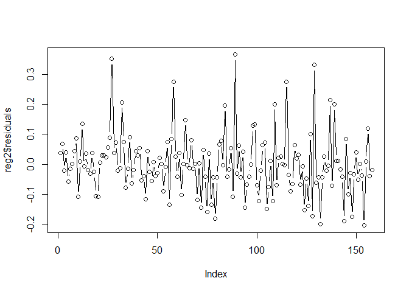
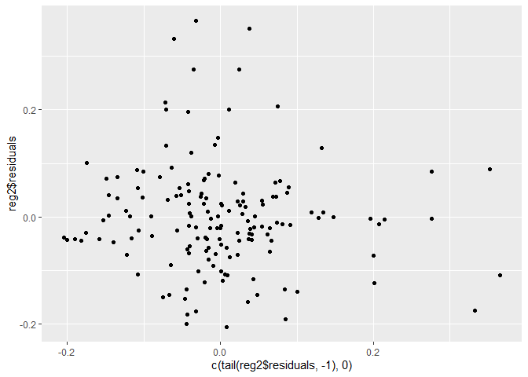
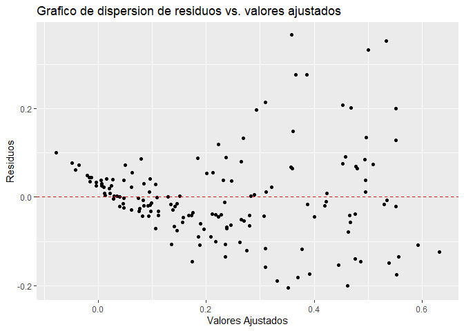
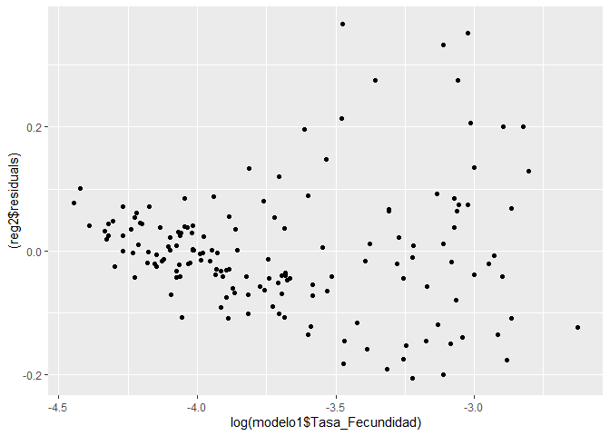
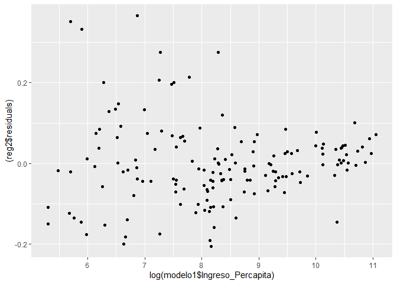

PROYECTO III
================
Mireya Rios
2024-03-28

``` r
library(openxlsx)
library()
```

``` r
################################SECCION A###############################################
modelo1<-read.xlsx("C:\\Users\\USUARIO\\Desktop\\R CURSO\\MODULO 3\\PROYECTO.xlsx")
attach(modelo1)
#Estimar la regresión log-log para interpretar tasas de crecimiento 

reg1<-lm(log(M1)~log(EXP),data=modelo1)
summary(reg1)
```

    ## 
    ## Call:
    ## lm(formula = log(M1) ~ log(EXP), data = modelo1)
    ## 
    ## Residuals:
    ##      Min       1Q   Median       3Q      Max 
    ## -0.95044 -0.31760  0.03717  0.31324  1.12563 
    ## 
    ## Coefficients:
    ##             Estimate Std. Error t value Pr(>|t|)    
    ## (Intercept) -0.14478    0.27139  -0.533    0.594    
    ## log(EXP)     1.31455    0.03786  34.723   <2e-16 ***
    ## ---
    ## Signif. codes:  0 '***' 0.001 '**' 0.01 '*' 0.05 '.' 0.1 ' ' 1
    ## 
    ## Residual standard error: 0.3811 on 287 degrees of freedom
    ## Multiple R-squared:  0.8077, Adjusted R-squared:  0.8071 
    ## F-statistic:  1206 on 1 and 287 DF,  p-value: < 2.2e-16

Al evaluar la significancia de los parámetros por el p-value, se observa
que el coeficiente asociado a las exportaciones es significativo,
mientras que el asociado alñ intercepto no lo es, dado que las
exportaciones generalmente no pueden ser cero en un contexto económico
real, la interpretación del intercepto pierde sentido.

En promedio, el incremento de un 1% en el nivel de exportaciones, la
oferta monetaria se incrementa en un 1.31%, además su signo denotandp
una relación positiva.

El R2-ajustado es del 0.8077, es decir, que la oferta monetaria está
explicada en un 80.77% de la variablidad en la oferta monetaria puede
ser explicada por la variable de exportaciones.

\################################SECCION
B###############################################

``` r
library(dplyr)
```

    ## 
    ## Attaching package: 'dplyr'

    ## The following objects are masked from 'package:stats':
    ## 
    ##     filter, lag

    ## The following objects are masked from 'package:base':
    ## 
    ##     intersect, setdiff, setequal, union

``` r
modelo1<-read.csv("C:\\Users\\USUARIO\\Desktop\\R CURSO\\MODULO 3\\MortalityFertilityIncome.csv") %>%
  select(Country.Name,m2016,i2016,f2016)
modelo1 <- modelo1 %>%
  rename(
    Pais = Country.Name,
    Tasa_Mortalidad = m2016,
    Ingreso_Percapita = i2016,
    Tasa_Fecundidad = f2016
  )
modelo1$Tasa_Mortalidad <- gsub(",", ".", modelo1$Tasa_Mortalidad)
modelo1$Ingreso_Percapita <- gsub(",", ".", modelo1$Ingreso_Percapita)
modelo1$Tasa_Fecundidad <- gsub(",", ".", modelo1$Tasa_Fecundidad)
modelo1$Tasa_Mortalidad<-as.numeric(modelo1$Tasa_Mortalidad)
modelo1$Ingreso_Percapita<-as.numeric(modelo1$Ingreso_Percapita)
modelo1$Tasa_Fecundidad<-as.numeric(modelo1$Tasa_Fecundidad)
modelo1<-modelo1%>%
  mutate(Tasa_Mortalidad=Tasa_Mortalidad/100,Tasa_Fecundidad=Tasa_Fecundidad/100)
modelo1 <- na.omit(modelo1)
###ESTIMAR LA REGRESION
reg2<-lm(Tasa_Mortalidad~log(Ingreso_Percapita)+log(Tasa_Fecundidad),data=modelo1)
summary(reg2)
```

    ## 
    ## Call:
    ## lm(formula = Tasa_Mortalidad ~ log(Ingreso_Percapita) + log(Tasa_Fecundidad), 
    ##     data = modelo1)
    ## 
    ## Residuals:
    ##      Min       1Q   Median       3Q      Max 
    ## -0.20446 -0.05024 -0.00690  0.04108  0.36569 
    ## 
    ## Coefficients:
    ##                         Estimate Std. Error t value Pr(>|t|)    
    ## (Intercept)             1.584896   0.067006  23.653  < 2e-16 ***
    ## log(Ingreso_Percapita) -0.052940   0.008746  -6.053 1.03e-08 ***
    ## log(Tasa_Fecundidad)    0.248220   0.028431   8.731 3.80e-15 ***
    ## ---
    ## Signif. codes:  0 '***' 0.001 '**' 0.01 '*' 0.05 '.' 0.1 ' ' 1
    ## 
    ## Residual standard error: 0.1009 on 155 degrees of freedom
    ## Multiple R-squared:  0.7615, Adjusted R-squared:  0.7584 
    ## F-statistic: 247.4 on 2 and 155 DF,  p-value: < 2.2e-16

``` r
modelo1$Tasa_Mortalidad_Estimada<-predict(reg2,newdata = modelo1)
```

Interpretacion de los resultados:

Los coeficientes asociados a las variables independientes, resultaron
estadisticamente significativos.

El coeficiente asociado a la tasa de fecundidad mantiene una relación
positiva con la tasa de mortalidad infantil, es decir, en promedio un
incremento de un 1% en la tasa de fecundidad incrementa en 0.24 unidades
porcentuales en la tasa de mortalidad infantil.

El coeficiente asociado al ingreso percapita mantiene una relacion
negativa con la tasa de mortalidad infantil, es decir, en promedio un
incremento de un 10% en el ingreso percapita, el nivel de mortalidad
infantil disminuye en -0.5 unidades porcentuales en la tasa de
mortalidad infantil.

El coeficiente de determinacion ajustado (R2-ajustado) nos indica que el
70.15% de la variabilidad de la variable dependiente esta explicada por
las variables incluidas en el modelo.

El estadístico F, rechaza la hipótesis nula, es decir que los
coeficientes no son igual a 0.

\#########################PRUEBAS DE SUPUESTOS

``` r
#Normalidad
library(strucchange)
```

    ## Warning: package 'strucchange' was built under R version 4.3.3

    ## Loading required package: zoo

    ## 
    ## Attaching package: 'zoo'

    ## The following objects are masked from 'package:base':
    ## 
    ##     as.Date, as.Date.numeric

    ## Loading required package: sandwich

    ## Warning: package 'sandwich' was built under R version 4.3.3

``` r
library(moments)
library(nortest)
jarque.test(as.vector(reg2$residuals))
```

    ## 
    ##  Jarque-Bera Normality Test
    ## 
    ## data:  as.vector(reg2$residuals)
    ## JB = 54.325, p-value = 1.598e-12
    ## alternative hypothesis: greater

``` r
# Rho. Los residuos no siguen una distribución normal
ad.test(reg2$residuals)
```

    ## 
    ##  Anderson-Darling normality test
    ## 
    ## data:  reg2$residuals
    ## A = 2.388, p-value = 4.559e-06

``` r
shapiro.test(reg2$residuals)
```

    ## 
    ##  Shapiro-Wilk normality test
    ## 
    ## data:  reg2$residuals
    ## W = 0.93735, p-value = 1.946e-06

``` r
#Autocorrelacion
library(car)
```

    ## Loading required package: carData

    ## 
    ## Attaching package: 'car'

    ## The following object is masked from 'package:dplyr':
    ## 
    ##     recode

``` r
library(ggplot2)
#metodo grafico
plot(reg2$residuals,type="b")
```

<!-- -->

``` r
qplot(x=c(tail(reg2$residuals,-1),0),
      y=reg2$residuals)
```

    ## Warning: `qplot()` was deprecated in ggplot2 3.4.0.
    ## This warning is displayed once every 8 hours.
    ## Call `lifecycle::last_lifecycle_warnings()` to see where this warning was
    ## generated.

<!-- -->

``` r
#Estadistivo Durbin Watson

library(lmtest)
dwtest(reg2)
```

    ## 
    ##  Durbin-Watson test
    ## 
    ## data:  reg2
    ## DW = 2.1618, p-value = 0.8445
    ## alternative hypothesis: true autocorrelation is greater than 0

``` r
#No Rho, es decir no existe un problema de autocorrelacion
```

``` r
#Heterocedasticidad
#metodo grafico
# Obtener residuos y valores ajustados
residuos <- residuals(reg2)
valores_ajustados <- predict(reg2)

# Crear un gráfico de dispersión de residuos vs. valores ajustados
ggplot(data = data.frame(Residuos = residuos, Valores_Ajustados = valores_ajustados), aes(x = Valores_Ajustados, y = Residuos)) +
  geom_point() +
  geom_hline(yintercept = 0, linetype = "dashed", color = "red") +  # Línea horizontal en y = 0
  labs(x = "Valores Ajustados", y = "Residuos", title = "Grafico de dispersion de residuos vs. valores ajustados")
```

<!-- -->

``` r
#######Aplicando para cada variable independiente
qplot(x=log(modelo1$Tasa_Fecundidad), # y estimada
      y=(reg2$residuals))+ # errores
  geom_point()
```

<!-- -->

``` r
# Podria estar causando la heterocedasticidad dado la forma de la gráfica.

qplot(x=log(modelo1$Ingreso_Percapita), # y estimada
      y=(reg2$residuals))+ # errores
  geom_point()
```

<!-- -->

``` r
#Se puede determinar visualmente, que la variable que puede estar causando la hetero es la tasa de fecundidad.
## Contraste Breush Pagan

bptest(reg2)
```

    ## 
    ##  studentized Breusch-Pagan test
    ## 
    ## data:  reg2
    ## BP = 26.292, df = 2, p-value = 1.953e-06

``` r
#R.ho la varianza de los errores no es homocedastica.

ncvTest(reg2)
```

    ## Non-constant Variance Score Test 
    ## Variance formula: ~ fitted.values 
    ## Chisquare = 54.18234, Df = 1, p = 1.8272e-13

``` r
# Problema de heterocedasticidad.

modelo_individual<-lm(abs(reg2$residuals)~log(Ingreso_Percapita),data=modelo1)
summary(modelo_individual)
```

    ## 
    ## Call:
    ## lm(formula = abs(reg2$residuals) ~ log(Ingreso_Percapita), data = modelo1)
    ## 
    ## Residuals:
    ##      Min       1Q   Median       3Q      Max 
    ## -0.11190 -0.03318 -0.01490  0.02245  0.26509 
    ## 
    ## Coefficients:
    ##                         Estimate Std. Error t value Pr(>|t|)    
    ## (Intercept)             0.241593   0.029135   8.292 4.84e-14 ***
    ## log(Ingreso_Percapita) -0.020514   0.003459  -5.931 1.87e-08 ***
    ## ---
    ## Signif. codes:  0 '***' 0.001 '**' 0.01 '*' 0.05 '.' 0.1 ' ' 1
    ## 
    ## Residual standard error: 0.06353 on 156 degrees of freedom
    ## Multiple R-squared:  0.184,  Adjusted R-squared:  0.1788 
    ## F-statistic: 35.18 on 1 and 156 DF,  p-value: 1.872e-08

``` r
modelo_individual<-lm(abs(reg2$residuals)~log(Tasa_Fecundidad),data=modelo1)
summary(modelo_individual)
```

    ## 
    ## Call:
    ## lm(formula = abs(reg2$residuals) ~ log(Tasa_Fecundidad), data = modelo1)
    ## 
    ## Residuals:
    ##      Min       1Q   Median       3Q      Max 
    ## -0.12310 -0.03288 -0.01187  0.02897  0.27767 
    ## 
    ## Coefficients:
    ##                      Estimate Std. Error t value Pr(>|t|)    
    ## (Intercept)           0.35612    0.04018   8.863 1.67e-15 ***
    ## log(Tasa_Fecundidad)  0.07714    0.01081   7.138 3.37e-11 ***
    ## ---
    ## Signif. codes:  0 '***' 0.001 '**' 0.01 '*' 0.05 '.' 0.1 ' ' 1
    ## 
    ## Residual standard error: 0.06106 on 156 degrees of freedom
    ## Multiple R-squared:  0.2462, Adjusted R-squared:  0.2414 
    ## F-statistic: 50.95 on 1 and 156 DF,  p-value: 3.368e-11

``` r
# el coeficiente asociado es significativo, por lo que la tasa de fecundidad y el ingreso percapita estan influenciando en el modelo afectando a la heterocedasticidad.

############### MULTICOLINEALIDAD
library(GGally)
```

    ## Warning: package 'GGally' was built under R version 4.3.3

    ## Registered S3 method overwritten by 'GGally':
    ##   method from   
    ##   +.gg   ggplot2

``` r
library(dynlm)
```

    ## Warning: package 'dynlm' was built under R version 4.3.3

``` r
library(forecast)
```

    ## Registered S3 method overwritten by 'quantmod':
    ##   method            from
    ##   as.zoo.data.frame zoo

``` r
library(nlme)
```

    ## 
    ## Attaching package: 'nlme'

    ## The following object is masked from 'package:forecast':
    ## 
    ##     getResponse

    ## The following object is masked from 'package:dplyr':
    ## 
    ##     collapse

``` r
library(sandwich)
library(car)
library(ggplot2)
library(lmtest)
ggpairs(modelo1[,2:4], lower = list(continuous = "smooth"),
        diag = list(continuous = "barDiag"), axisLabels = "none")
```

    ## `stat_bin()` using `bins = 30`. Pick better value with `binwidth`.

    ## `stat_bin()` using `bins = 30`. Pick better value with `binwidth`.
    ## `stat_bin()` using `bins = 30`. Pick better value with `binwidth`.

<!-- -->

``` r
# El par de variables con el coeficiente de correlación mayor se da entre la tasa de mortalidad y la tasa de fecundidad, de manera positiva.
reg2<-lm(Tasa_Mortalidad~log(Ingreso_Percapita)+log(Tasa_Fecundidad),data=modelo1)
vif(reg2)
```

    ## log(Ingreso_Percapita)   log(Tasa_Fecundidad) 
    ##               2.536077               2.536077

``` r
#VIF menor a 10, no hay predictores que muestren una inflación de varianza.
#ATENUANDO LA HETEROCEDASTICIDAD

# Se paplica un modelo no invasivo robusto a la heterocedasticidad y autocorrelación. NeweyWest
#metodo no invasivo
coeftest(reg2,vcov. = NeweyWest(reg2))
```

    ## 
    ## t test of coefficients:
    ## 
    ##                          Estimate Std. Error t value  Pr(>|t|)    
    ## (Intercept)             1.5848958  0.0749955 21.1332 < 2.2e-16 ***
    ## log(Ingreso_Percapita) -0.0529397  0.0075864 -6.9782 8.185e-11 ***
    ## log(Tasa_Fecundidad)    0.2482202  0.0268134  9.2573 < 2.2e-16 ***
    ## ---
    ## Signif. codes:  0 '***' 0.001 '**' 0.01 '*' 0.05 '.' 0.1 ' ' 1
