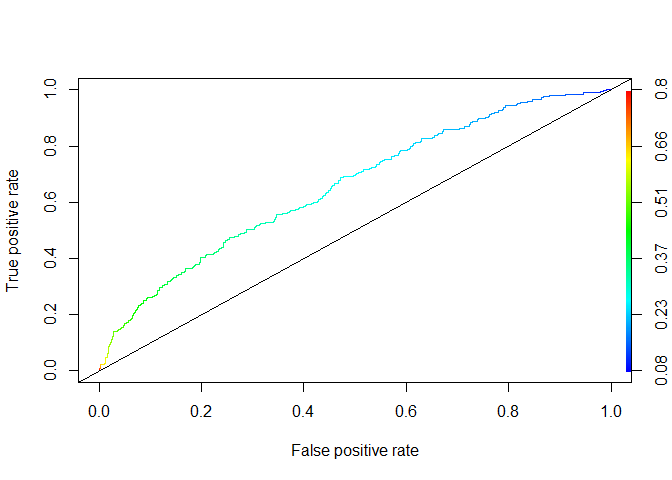
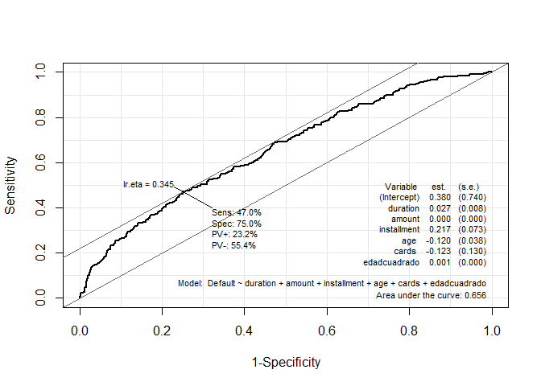
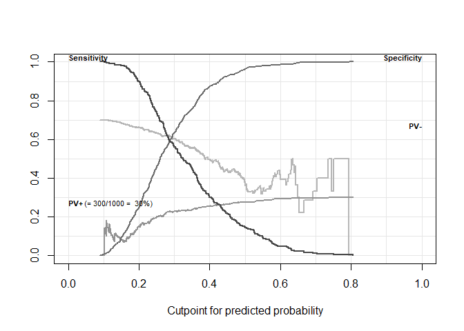
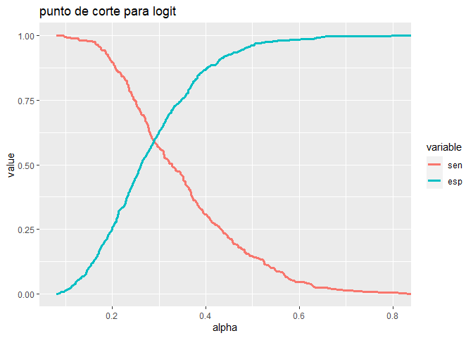
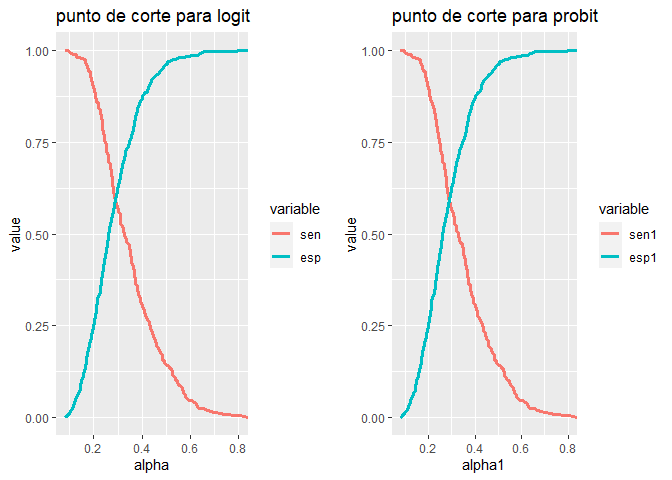

PROYECTO 4
================
Mireya Rios
2024-04-09

``` r
#1.Carga el archivo germancredit.csv a RStudio
base<-read.csv("C:\\Users\\USUARIO\\Desktop\\R CURSO\\MODULO 4\\Base-y-presentacion_4681YE\\Base y presentación\\germancredit.csv")
```

``` r
#CARGANDO LAS LIBRERIAS
### Carguemos las librerias ### ====

library(foreign)
library(gmodels)
```

    ## Warning: package 'gmodels' was built under R version 4.3.3

``` r
library(ResourceSelection)
```

    ## Warning: package 'ResourceSelection' was built under R version 4.3.3

    ## ResourceSelection 0.3-6   2023-06-27

``` r
library(ROCR)
```

    ## Warning: package 'ROCR' was built under R version 4.3.3

``` r
library(Epi)
```

    ## Warning: package 'Epi' was built under R version 4.3.3

``` r
library(QuantPsyc)
```

    ## Warning: package 'QuantPsyc' was built under R version 4.3.3

    ## Loading required package: boot

    ## Loading required package: dplyr

    ## 
    ## Attaching package: 'dplyr'

    ## The following objects are masked from 'package:stats':
    ## 
    ##     filter, lag

    ## The following objects are masked from 'package:base':
    ## 
    ##     intersect, setdiff, setequal, union

    ## Loading required package: purrr

    ## Loading required package: MASS

    ## 
    ## Attaching package: 'MASS'

    ## The following object is masked from 'package:dplyr':
    ## 
    ##     select

    ## 
    ## Attaching package: 'QuantPsyc'

    ## The following object is masked from 'package:base':
    ## 
    ##     norm

``` r
library(ggplot2)
library(memisc)
```

    ## Warning: package 'memisc' was built under R version 4.3.3

    ## Loading required package: lattice

    ## 
    ## Attaching package: 'lattice'

    ## The following object is masked from 'package:boot':
    ## 
    ##     melanoma

    ## 
    ## Attaching package: 'memisc'

    ## The following object is masked from 'package:ggplot2':
    ## 
    ##     syms

    ## The following object is masked from 'package:purrr':
    ## 
    ##     %@%

    ## The following objects are masked from 'package:dplyr':
    ## 
    ##     collect, recode, rename, syms

    ## The following objects are masked from 'package:stats':
    ## 
    ##     contr.sum, contr.treatment, contrasts

    ## The following object is masked from 'package:base':
    ## 
    ##     as.array

``` r
library(dplyr)
```

``` r
##Construye una función: Default (1=mal pagador), duration (plazo de la operación),amount(monto de la operación), installment(cuotas pagadas),age, edad al cuadrado, cards (número de tarjetas de crédito) través de un modelo logit Y probit.
base_final<-base %>% dplyr::select(Default,duration,amount,installment,age,cards)
base_final<-base_final %>% mutate(edadcuadrado=age^2)
attach(base_final)
logit<-glm(Default~.,
           family = binomial(link="logit"),
           data=base_final)
summary(logit)
```

    ## 
    ## Call:
    ## glm(formula = Default ~ ., family = binomial(link = "logit"), 
    ##     data = base_final)
    ## 
    ## Coefficients:
    ##                Estimate Std. Error z value Pr(>|z|)    
    ## (Intercept)   3.799e-01  7.400e-01   0.513 0.607706    
    ## duration      2.695e-02  7.714e-03   3.494 0.000475 ***
    ## amount        7.346e-05  3.407e-05   2.156 0.031076 *  
    ## installment   2.165e-01  7.290e-02   2.970 0.002978 ** 
    ## age          -1.202e-01  3.775e-02  -3.184 0.001454 ** 
    ## cards        -1.228e-01  1.301e-01  -0.944 0.345172    
    ## edadcuadrado  1.227e-03  4.499e-04   2.727 0.006386 ** 
    ## ---
    ## Signif. codes:  0 '***' 0.001 '**' 0.01 '*' 0.05 '.' 0.1 ' ' 1
    ## 
    ## (Dispersion parameter for binomial family taken to be 1)
    ## 
    ##     Null deviance: 1221.7  on 999  degrees of freedom
    ## Residual deviance: 1152.1  on 993  degrees of freedom
    ## AIC: 1166.1
    ## 
    ## Number of Fisher Scoring iterations: 4

\#SIGNOS En su mayoria las variables registran significancia
estadística, el monto de la operación mantiene significancia al 95% de
confianza. Mientras que la variable, numero de tarjetas de crédito no
mantiene significancia estadística.

``` r
#Obteniendo los odds ratio
exp(coefficients(logit))
```

    ##  (Intercept)     duration       amount  installment          age        cards 
    ##    1.4621324    1.0273206    1.0000735    1.2417341    0.8867594    0.8844245 
    ## edadcuadrado 
    ##    1.0012276

La variable con mayor magnitud, es el numero de cuotas pagadas,
incrementar las cuotas pagadas aumenta la probabilidad de caer en
defautl en 1.24 veces, es decir existe una relación positiva. Las
variables duracion del credito, monto y edad al cuadrado, registran
tambien una relacion positiva, a medida que aumentan la probabilidad de
que el cliente caiga en default incrementa. En cuando a la variable,
pese a no ser sginificativa, el numero de tarjetas mantiene una
asociacion negativa, a medida que esta aumenta la probabilidad de que el
cliente caiga en default disminuye. Por cada unidad que se incremente la
variable cards la probabilidad de caer en defaul se incrementa en
promedio en 0.88 unidades.

``` r
probit<-glm(Default~.,
           family = binomial(link="probit"),
           data=base_final)

summary(probit)
```

    ## 
    ## Call:
    ## glm(formula = Default ~ ., family = binomial(link = "probit"), 
    ##     data = base_final)
    ## 
    ## Coefficients:
    ##                Estimate Std. Error z value Pr(>|z|)    
    ## (Intercept)   1.942e-01  4.445e-01   0.437 0.662136    
    ## duration      1.656e-02  4.688e-03   3.533 0.000411 ***
    ## amount        4.386e-05  2.073e-05   2.116 0.034379 *  
    ## installment   1.271e-01  4.310e-02   2.949 0.003189 ** 
    ## age          -7.078e-02  2.252e-02  -3.143 0.001674 ** 
    ## cards        -7.333e-02  7.674e-02  -0.956 0.339257    
    ## edadcuadrado  7.200e-04  2.682e-04   2.684 0.007269 ** 
    ## ---
    ## Signif. codes:  0 '***' 0.001 '**' 0.01 '*' 0.05 '.' 0.1 ' ' 1
    ## 
    ## (Dispersion parameter for binomial family taken to be 1)
    ## 
    ##     Null deviance: 1221.7  on 999  degrees of freedom
    ## Residual deviance: 1151.9  on 993  degrees of freedom
    ## AIC: 1165.9
    ## 
    ## Number of Fisher Scoring iterations: 4

``` r
exp(coefficients(probit))
```

    ##  (Intercept)     duration       amount  installment          age        cards 
    ##    1.2143538    1.0167014    1.0000439    1.1355277    0.9316635    0.9292931 
    ## edadcuadrado 
    ##    1.0007203

``` r
# Utiliza la función mtable para generar una tabla comparativa de modelos
mtable(logit = logit, probit = probit,digits = 6, sdigits = 3)
```

    ## 
    ## Calls:
    ## logit: glm(formula = Default ~ ., family = binomial(link = "logit"), 
    ##     data = base_final)
    ## probit: glm(formula = Default ~ ., family = binomial(link = "probit"), 
    ##     data = base_final)
    ## 
    ## ==================================================
    ##                       logit           probit      
    ## --------------------------------------------------
    ##   (Intercept)        0.379896        0.194212     
    ##                     (0.740033)      (0.444455)    
    ##   duration           0.026954***     0.016563***  
    ##                     (0.007714)      (0.004688)    
    ##   amount             0.000073*       0.000044*    
    ##                     (0.000034)      (0.000021)    
    ##   installment        0.216509**      0.127097**   
    ##                     (0.072900)      (0.043100)    
    ##   age               -0.120182**     -0.070784**   
    ##                     (0.037749)      (0.022523)    
    ##   cards             -0.122818       -0.073331     
    ##                     (0.130105)      (0.076735)    
    ##   edadcuadrado       0.001227**      0.000720**   
    ##                     (0.000450)      (0.000268)    
    ## --------------------------------------------------
    ##   Log-likelihood  -576.067        -575.947        
    ##   N               1000            1000            
    ## ==================================================
    ##   Significance: *** = p < 0.001; ** = p < 0.01;   
    ##                 * = p < 0.05

``` r
# Estadísticas AIC y BIC
AIC_logit <- AIC(logit)
BIC_logit <- BIC(logit)
AIC_probit <- AIC(probit)
BIC_probit <- BIC(probit)
print("AIC y BIC:")
```

    ## [1] "AIC y BIC:"

``` r
print(AIC_logit)
```

    ## [1] 1166.134

``` r
print(BIC_logit)
```

    ## [1] 1200.488

``` r
print(AIC_probit)
```

    ## [1] 1165.894

``` r
print(BIC_probit)
```

    ## [1] 1200.248

``` r
#Un modelo AIC O BIC más bajo generalmente es el preferido, en este caso las diferencias son pequeñas pero el modelo logit mantiene el menor indicador en los criterios antes mencionados.
```

Como el modelo anterior, las significancia de las variables se mantiene,
siendo la variable cards no significativa, la variable que influye en la
probabilidad de mora con mayor magnitud es el numero de cuotas pagadas.

``` r
######3Construye los contrastes HL, matriz de confusión, curva ROC, área bajo la curva de los tres modelos y encuentra el punto de corte óptimo de los 2 modelos
#######################Bondad de ajuste
hl1<-hoslem.test(base_final$Default,fitted(logit),g=10)
hl2<-hoslem.test(base_final$Default,fitted(probit),g=10)
hl1
```

    ## 
    ##  Hosmer and Lemeshow goodness of fit (GOF) test
    ## 
    ## data:  base_final$Default, fitted(logit)
    ## X-squared = 7.6569, df = 8, p-value = 0.4677

``` r
hl2
```

    ## 
    ##  Hosmer and Lemeshow goodness of fit (GOF) test
    ## 
    ## data:  base_final$Default, fitted(probit)
    ## X-squared = 8.0644, df = 8, p-value = 0.4272

``` r
### Ambos modelos no rechazan la hipotesis nula, por lo tanto tienen una buena bondad de ajuste

# Prueba de razón de verosimilitud
library(lmtest)
```

    ## Loading required package: zoo

    ## 
    ## Attaching package: 'zoo'

    ## The following objects are masked from 'package:base':
    ## 
    ##     as.Date, as.Date.numeric

``` r
lr_test <- lrtest(logit, probit)
print("Prueba de razón de verosimilitud:")
```

    ## [1] "Prueba de razón de verosimilitud:"

``` r
print(lr_test)
```

    ## Likelihood ratio test
    ## 
    ## Model 1: Default ~ duration + amount + installment + age + cards + edadcuadrado
    ## Model 2: Default ~ duration + amount + installment + age + cards + edadcuadrado
    ##   #Df  LogLik Df  Chisq Pr(>Chisq)    
    ## 1   7 -576.07                         
    ## 2   7 -575.95  0 0.2405  < 2.2e-16 ***
    ## ---
    ## Signif. codes:  0 '***' 0.001 '**' 0.01 '*' 0.05 '.' 0.1 ' ' 1

``` r
#matriz de confusion
# umbral con base en la media, son similares porque las curvas son similares, la del probit es mas achatada nada más
umbral_threshold<-mean(fitted(logit))
umbral_threshold1<-mean(fitted(probit))
umbral_threshold
```

    ## [1] 0.3

``` r
umbral_threshold1
```

    ## [1] 0.2998774

``` r
######## tabla de clasificacion
ClassLog(logit,base_final$Default,cut=umbral_threshold)
```

    ## $rawtab
    ##        resp
    ##           0   1
    ##   FALSE 444 132
    ##   TRUE  256 168
    ## 
    ## $classtab
    ##        resp
    ##                 0         1
    ##   FALSE 0.6342857 0.4400000
    ##   TRUE  0.3657143 0.5600000
    ## 
    ## $overall
    ## [1] 0.612
    ## 
    ## $mcFadden
    ## [1] 0.05696396

``` r
ClassLog(logit,base_final$Default,cut=umbral_threshold1)
```

    ## $rawtab
    ##        resp
    ##           0   1
    ##   FALSE 443 132
    ##   TRUE  257 168
    ## 
    ## $classtab
    ##        resp
    ##                 0         1
    ##   FALSE 0.6328571 0.4400000
    ##   TRUE  0.3671429 0.5600000
    ## 
    ## $overall
    ## [1] 0.611
    ## 
    ## $mcFadden
    ## [1] 0.05696396

``` r
#el porcentaje de clasificacion correcta, es cercano al 61%
##############eavular la capacidad predictiva

pred1<-prediction(logit$fitted.values,base_final$Default)
pred2<-prediction(probit$fitted.values,base_final$Default)
perf1<-performance(pred1,
                   measure = "tpr",
                   x.measure = "fpr")
perf2<-performance(pred2,
                   measure = "tpr",
                   x.measure = "fpr")
plot(perf1,colorize=T,lty=3)
abline(0,1,col="black")
```

<!-- -->

``` r
plot(perf2,colorize=T,lty=3)
abline(0,1,col="black")
```

<!-- -->

``` r
#el modelo denota que la curva esta cercana a la linea.
#recupero el area bajo la curva
auc1<-performance(pred1,measure = "auc")
auc1<-auc1@y.values[[1]]
auc2<-performance(pred2,measure = "auc")
auc2<-auc2@y.values[[1]]
auc1
```

    ## [1] 0.6558952

``` r
auc2 # más cercano a 1, el área de la curva es man grande, sugiere >80
```

    ## [1] 0.6557667

``` r
#cuando los resultados son similares, se decide por simplicidad

########usaremos Epi para ael logit

ROC(form = Default~ duration+amount+installment+age+cards+edadcuadrado,plot="ROC") #solo para el logit
```

<!-- -->

``` r
ROC(form = Default~ duration+amount+installment+age+cards+edadcuadrado,plot="sp") #solo para el logit
```

<!-- -->

``` r
##########Para el probit
perf2<-performance(pred2,"sens","spec")
sen<-slot(perf2,"y.values")[[1]]
esp<-slot(perf2,"x.values")[[1]]
alpha<-slot(perf2,"alpha.values")[[1]]
mat<-data.frame(alpha,sen,esp)

##########Para el probit
perf1<-performance(pred2,"sens","spec")
sen1<-slot(perf1,"y.values")[[1]]
esp1<-slot(perf1,"x.values")[[1]]
alpha1<-slot(perf1,"alpha.values")[[1]]
mat1<-data.frame(alpha1,sen1,esp1)

library(reshape2)
library(gridExtra)
```

    ## 
    ## Attaching package: 'gridExtra'

    ## The following object is masked from 'package:dplyr':
    ## 
    ##     combine

``` r
m<-melt(mat,id=c("alpha"))
m2<-melt(mat1,id=c("alpha1"))

graf1<-ggplot(m,aes(alpha,value,group=variable,colour=variable))+ geom_line(size=1.2)+
  labs(title = "punto de corte para logit")
```

    ## Warning: Using `size` aesthetic for lines was deprecated in ggplot2 3.4.0.
    ## ℹ Please use `linewidth` instead.
    ## This warning is displayed once every 8 hours.
    ## Call `lifecycle::last_lifecycle_warnings()` to see where this warning was
    ## generated.

``` r
graf1
```

<!-- -->

``` r
graf2<-ggplot(m2,aes(alpha1,value,group=variable,colour=variable))+ geom_line(size=1.2)+
  labs(title = "punto de corte para probit")
graf2
```

<!-- -->

``` r
library(plotly)
```

    ## 
    ## Attaching package: 'plotly'

    ## The following objects are masked from 'package:memisc':
    ## 
    ##     rename, style

    ## The following object is masked from 'package:ggplot2':
    ## 
    ##     last_plot

    ## The following object is masked from 'package:MASS':
    ## 
    ##     select

    ## The following object is masked from 'package:stats':
    ## 
    ##     filter

    ## The following object is masked from 'package:graphics':
    ## 
    ##     layout

``` r
#ggplotly(graf1) #punto de corte optimo 0.59 para el logit
#ggplotly(graf2) #punto de corte optimo 0.58 para el probit
g1<-grid.arrange(graf1,graf2,ncol=2)
```

<!-- -->

``` r
######## tabla de clasificacion
####Vuelve a estimar la matriz de clasificación con el nuevo umbral y reporta el porcentaje de clasificación correcta
umbral_threshold<-0.59
umbral_threshold1<-0.58
ClassLog(logit,base_final$Default,cut=umbral_threshold)
```

    ## $rawtab
    ##        resp
    ##           0   1
    ##   FALSE 689 285
    ##   TRUE   11  15
    ## 
    ## $classtab
    ##        resp
    ##                  0          1
    ##   FALSE 0.98428571 0.95000000
    ##   TRUE  0.01571429 0.05000000
    ## 
    ## $overall
    ## [1] 0.704
    ## 
    ## $mcFadden
    ## [1] 0.05696396

``` r
ClassLog(logit,base_final$Default,cut=umbral_threshold1)
```

    ## $rawtab
    ##        resp
    ##           0   1
    ##   FALSE 688 282
    ##   TRUE   12  18
    ## 
    ## $classtab
    ##        resp
    ##                  0          1
    ##   FALSE 0.98285714 0.94000000
    ##   TRUE  0.01714286 0.06000000
    ## 
    ## $overall
    ## [1] 0.706
    ## 
    ## $mcFadden
    ## [1] 0.05696396

``` r
#el porcentaje de clasificacion correcta, es cercano al 71%, 10 puntos porcentuales más que aplicando la media.

######################proyecciones
###Realice una proyección con valores hipotéticos (puedes inventarte los valores), muestre los valores y la proyección de los 2 modelos
newdata<-data.frame(duration=60,
                    amount=1000,
                    installment=3,
                    age=29,
                    cards=3,
                    edadcuadrado=841)
predict(logit,newdata,type="response")
```

    ##         1 
    ## 0.4745756

``` r
predict(probit,newdata,type="response")
```

    ##         1 
    ## 0.4784594

``` r
# ELECCION DEL MODELO
# Dado que los estadísticos y la significancia de los parámetros son similares, para la siguiente estimación se prefiere al modelo logit dado que es ligeramente mas robusto que el probit frente a la presencia de valores atípicos en los datos, dado que tiene colas más pesadas que función normal que se utiliza en el probit.
```
